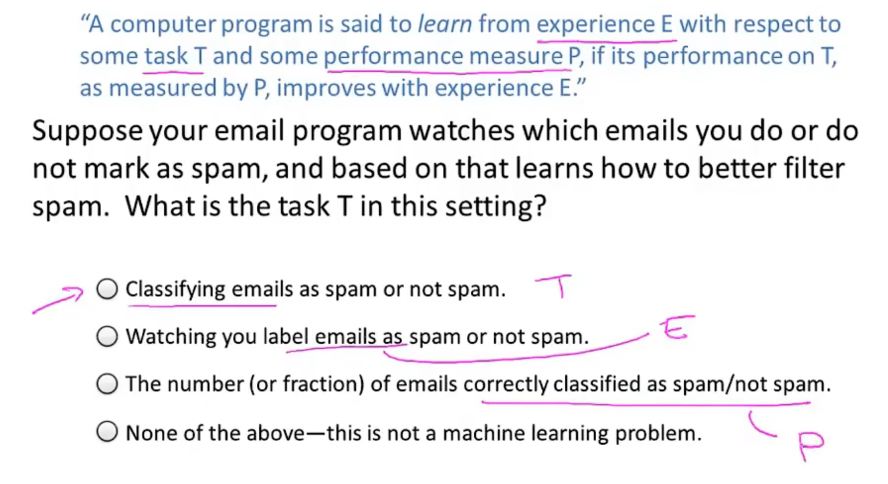
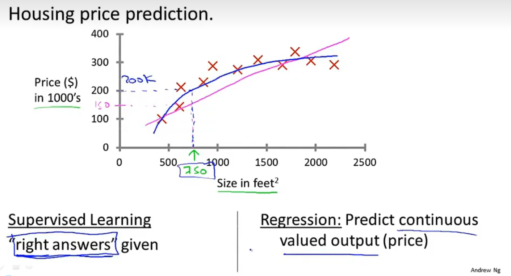
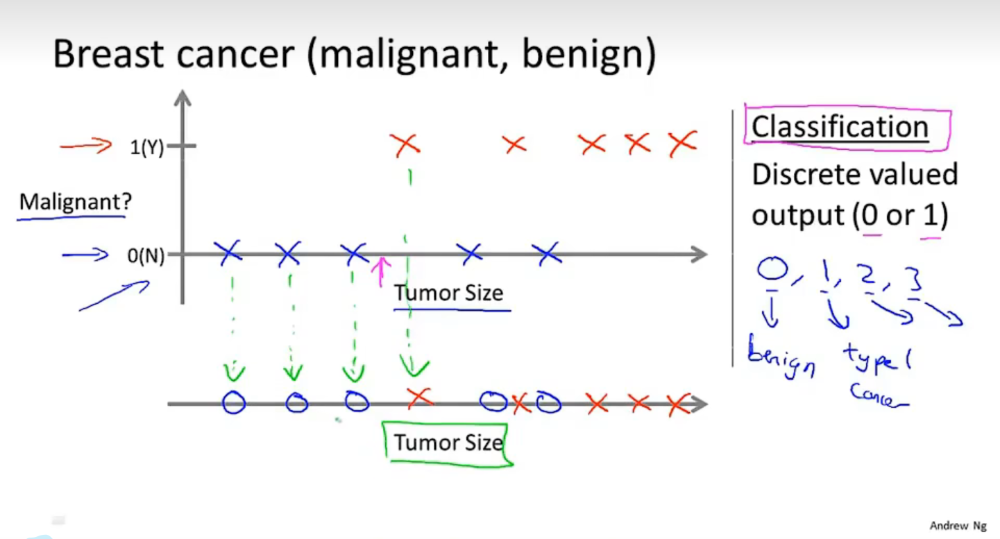
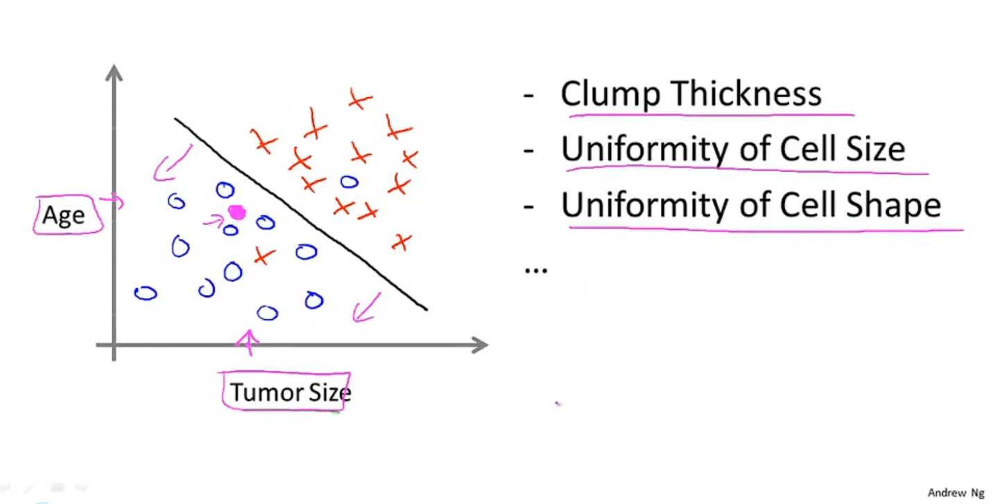
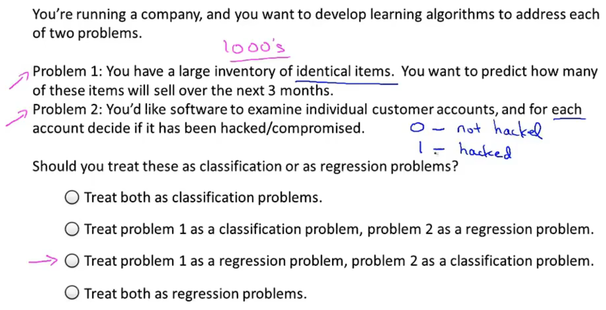
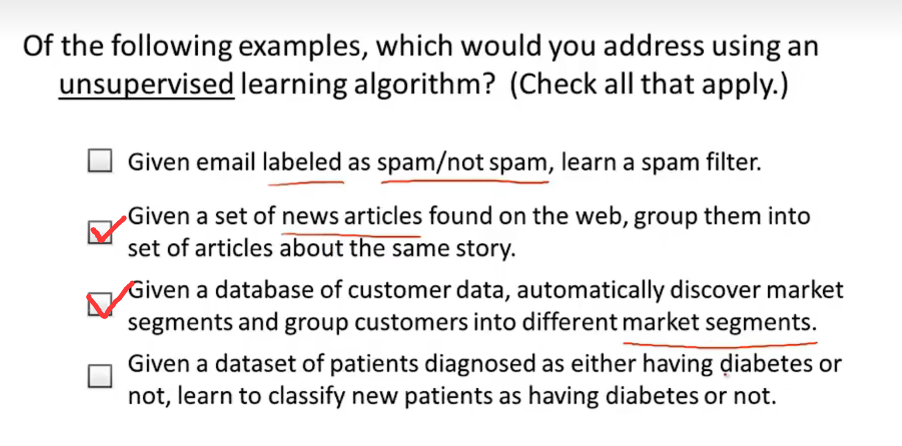

# 1 Inroduction

## 1.1 欢迎参加《机器学习》课程  | Welcome

> - 机器学习在日常生活中有很多应用（e.g.搜索引擎排序，照片人脸识别etc）
> - 但是只知道算法和数学公式是不够的，所以本课程还是设计了许多project，让你去了解ML的应用
>

### （1）Machine Learning

- Grew out of work in Al（ML是AI发展出来的一个领域）
- New capability for computers

### （2）Examples

- Database mining
Large datasets from growth of automation/web.
E.g., Web click data, medical records, biology, engineering
- Applications can't program by hand.
  E.g., Autonomous helicopter, handwriting recognition, most of Natural Language Processing(NLP), Computer Vision.
- Self-customizing programs
  E.g., Amazon, Netflix product recommendations

## 1.2 什么是机器学习 | What is machine Learning

### （1）Machine Learning definition

- Arthur Samuel (1959).Machine Learning: Field of study that gives computers the ability to learn without being explicitly programmed.
- Tom Mitchell (1998) Well-posed LearningProblem: **A computer program is said to learn from experience E with respect to some task T and some performance measure P, if its performance on T, as measured by P, improves with experience E.**

### 练习1：判断E/T/P

### (2)Machine learning algorithms

- Supervised learning
- Unsupervised learning

Others: Reinforcement learning, recommender systems.
Also talk about: Practical advice for applying learning algorithms.

## 1.3 监督学习 | Supervised learning

### （1）Regression 回归

### （2）Classification 分类

### 练习2：判断回归和分类

## 1.4 无监督学习 | Unsupervised learning

**聚类算法**（e.g. 新闻算法，市场分类etc）

其他算法，如鸡尾酒酒会算法

### 练习3：分辨监督学习和无监督学习

